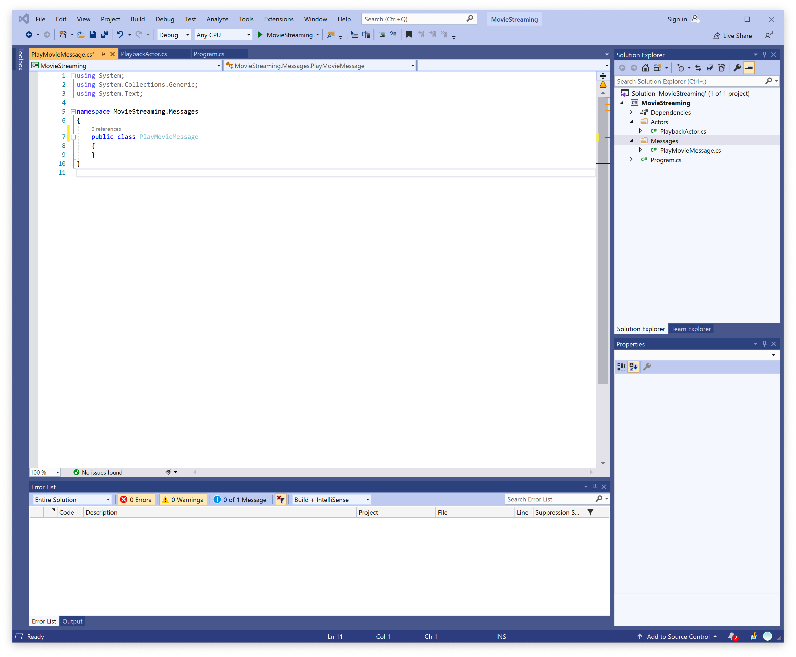
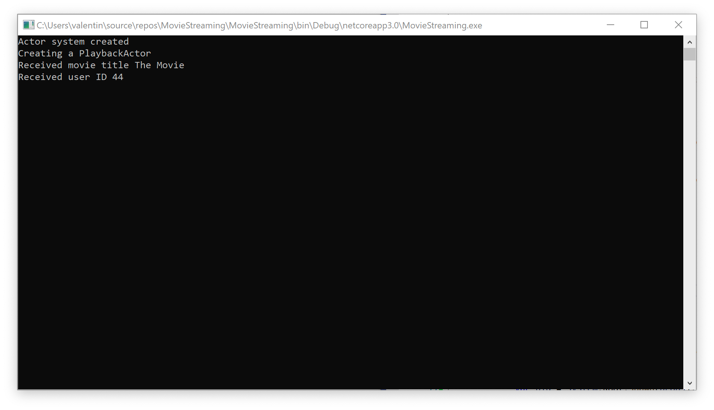

# Урок 7: Отправка пользовательского сообщения.

Из этого урока вы узнаете, как можно создать пользовательское сообщение и отправить его нашему автору. А также как модифицировать наш актор, чтобы он мог работать с пользовательскими сообщениями.

Для более удобной работы, давайте немного модифицируем наш проект, для этого перейдём в нашу IDE и создадим две папки. Первая папка будет называться Actors и в ней мы будем хранить все наши акторы. Вторую папку назовём Messages, и она будет содержать все наши пользовательские сообщения.

Далее давайте вынесем PlaybackActor в отдельный файл в папке Actors. Затем создадим новый класс PlayMovieMessage в папке Messages. По итогу наш проект должен выглядеть следующим образом.



Теперь мы можем приступить к более подробному изучению пользовательских сообщений. Как уже говорилось ранее в этом курсе, пользовательские сообщения не должны наследоваться от какого-либо специального базового класса. 

Таким образом, все, что требуется для создания пользовательского сообщения, это определение свойств и конструктора который будет инициализировать эти свойства.

Давайте рассмотрим этот процесс более подробно. В предыдущем уроке мы передавали два сообщения нашему актору. Теперь давайте обледеним эти сообщения в одно. 

Для начала добавим в наше пользовательское сообщение два свойства, первое свойство MovieTitle которое представляет собой строку, описывающие название фильма, а второе свойство `UserId` содержит идентификатор пользователя.

```c#
public class PlayMovieMessage
{
     public string MovieTitle { get; }
     public int UserId { get; }
}
```

Далее нам нужно добавить конструктор класса, который будет инициализировать данные свойства  переданными значениями. В итоге у нас должен получиться следующий код.

```c#
public class PlayMovieMessage
{
     public string MovieTitle { get; }
     public int UserId { get; }
  
     public PlayMovieMessage(string movieTitle, int userId)
     {
         MovieTitle = movieTitle;
         UserId = userId;
     }
}
```

После того как мы создали пользовательское сообщение, давайте изменим наш код из предыдущего урока, чтобы он мог работать с нашим пользовательским сообщением. Для начало изменим класс `Program` чтобы он мог отсылать наше сообщение.

```c#
class Program
{
    static void Main(string[] args)
    {
        var system = new ActorSystem();
        Console.WriteLine("Actor system created");

        var props = Props.FromProducer(() => new PlaybackActor());
        var pid = system.Root.Spawn(props);

        system.Root.Send(pid, new PlayMovieMessage("The Movie", 44));

        Console.ReadLine();
    }
}
```

Далее изменим код PlaybackActor чтобы он мог распознавать и обрабатывать  `PlayMovieMessage`.

```c#
public class PlaybackActor : IActor
{
    public PlaybackActor() => Console.WriteLine("Creating a PlaybackActor");
  
    public Task ReceiveAsync(IContext context)
    {
        switch (context.Message)
        {
            case PlayMovieMessage msg:
                Console.WriteLine($"Received movie title {msg.MovieTitle}");
                Console.WriteLine($"Received user ID {msg.UserId}");
                break;
        }
        return Actor.Done;
    }
}
```

Как вы видите, все что мы сделали это изменили тип сообщений в оператор switch и добавили извлечение значений из свойств сообщения.

Если мы запустим наше приложение, то сможем убедиться, что оно не чем не отличается от того, что мы сделали предыдущем уроке.



Также платформа Proto.Actor позволяет создавать сообщения на базе технологии gRPC, что позволит  общаться акторам, написанным на разных языках программирования. Но об этом мы поговорим в следующих уроках.