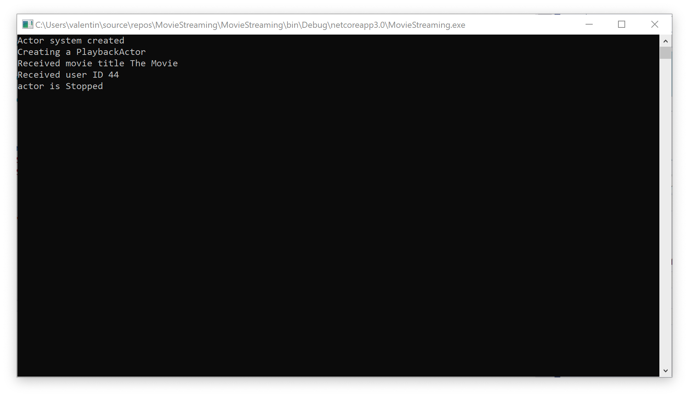

# Урок 4: Что такое сообшение Poison Pill и как с ним работать.

В этом уроке мы с вами рассмотрим, что такое сообщение `PoisonPill()` и чем оно отличается от сообщения `Stop()`.

Как и сообщение `Stop()`, `PoisonPill()` служит для завершения работы актора и остановки очереди сообщений. Оба этих сообщения заставляют актор прекратить обработку входящих сообщений и отправить сообщение об остановке всем своим дочерним акторам, а так же дождаться их завершения. После чего направить нашему коду сообщение `Stopped()` которое сигнализирует о полной остановке актора. Так же стоит иметь в виду, что все последующие сообщения отправленные на адрес нашего актора, будут переправляться в почтовый ящик dead letters.

Разница между сообщениями `Stop()` и `PoisonPill()` заключается в приоритете их обработки. При отправке системного сообщения `Stop()` обработка всех пользовательских сообщений будет немедленно завершена за исключением текущего сообщения. Если же мы используем сообщение `PoisonPill()` то оно будет помешено в очередь, пользовательских сообщений и обработано в порядке обшей очереди, с остальными пользовательскими сообщениями. Таким образом, все пользовательские сообщения, находящиеся в очереди до `PoisonPill()` будут обработаны.

И так давайте посмотрим, как мы можем отправить сообщение `PoisonPill()` нашему актору `PlaybackActor()`.

Давайте откроем наш проект и добавим отправку сообщения `PoisonPill()` в класс `Program()`. Это делается с помощью 

```c#
system.Root.Poison(pid);
```

по итогу у нас должен получится следующий код.

```c#
class Program
{
    static void Main(string[] args)
    {
        var system = new ActorSystem();
        Console.WriteLine("Actor system created");

        var props = Props.FromProducer(() => new PlaybackActor());
        var pid = system.Root.Spawn(props);

        system.Root.Send(pid, new PlayMovieMessage("The Movie", 44));

        system.Root.Poison(pid);

        Console.ReadLine();
    }
}
```

Теперь нам нужно отредактировать актор `PlaybackActor()` что бы он мог обрабатывать сообщение `Stopped()`.

```c#
public class PlaybackActor : IActor
{
    public PlaybackActor() => Console.WriteLine("Creating a PlaybackActor");
    public Task ReceiveAsync(IContext context)
    {
        switch (context.Message)
        {
            case PlayMovieMessage msg:
                Console.WriteLine($"Received movie title {msg.MovieTitle}");
                Console.WriteLine($"Received user ID {msg.UserId}");
                break;

            case Stopped msg:
                Console.WriteLine("actor is Stopped");
                break;
        }
        return Actor.Done;
    }
}
```

Теперь запустим наше приложение и посмотрим что получилось.



Как вы видите актор успешно завершил свою работу.