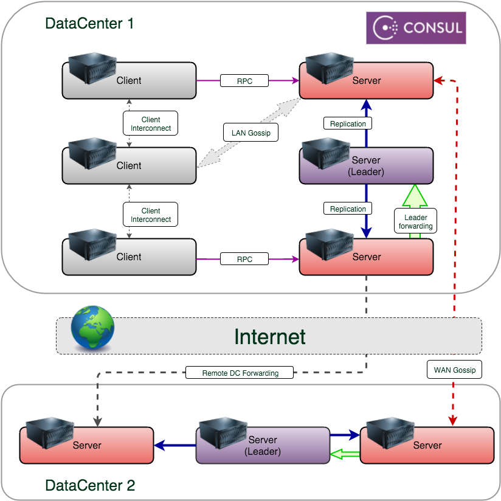
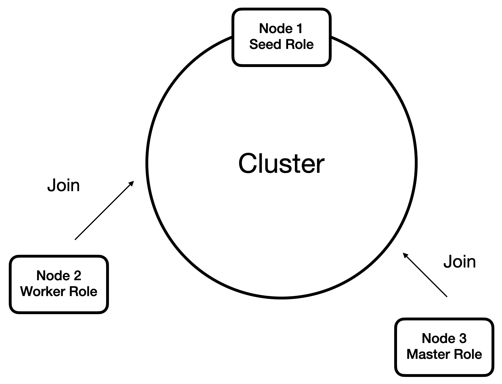

# Урок 3:  Присоединение к кластеру

На текущий момент, платформа Proto.Actor поддерживает два основных провайдера для обледенения в кластеры. 

Первый из них и наиболее предпочтительный для создания больших кластеров. Это провайдер на основе платформы **Consul** ([http://consul.io](https://consul.io/)). **Consul** представляет из себя discovery-сервис. Discovery-сервис это инструмент для обеспечения связи между компонентами архитектуры. Используя discovery мы обеспечиваем *связность* между компонентами приложения, но не *связанность*. Discovery можно рассматривать как некий реестр метаинформации о распределённой архитектуре, в котором хранятся все данные о компонентах. Это позволяет реализовать взаимодействие компонентов с минимальным ручным вмешательством.

#### Роль discovery в процессе построения распределенной архитектуры

Discovery-сервис обеспечивает три основных функции, на которых базируется связность в рамках распределенной архитектуры:

- Консистентность метаинформации о сервисах в рамках кластера.
- Механизм для регистрации и мониторинга доступности компонентов.
- Механизм для обнаружения компонентов.

Раскроем значения каждого пункта подробно:

*Консистентность*
Распределённая архитектура подразумевает, что компоненты можно масштабировать горизонтально, при этом они должны владеть актуальной информацией о состоянии кластера. Discovery-сервис обеспечивает (де) централизованное хранилище и доступ к нему для любого узла. Компоненты могут сохранять свои данные, и информация будет доставлена ко всем заинтересованным участникам кластера.

*Регистрация и мониторинг*
Вновь добавляемые сервисы должны сообщить о себе, а уже запущенные обязаны проходить постоянную проверку на доступность. Это является необходимым условием для автоматической конфигурации кластера. Балансеры трафика и зависимые ноды обязательно должны иметь информацию о текущей конфигурации кластера для эффективного использования ресурсов.

*Обнаружение*
Под обнаружением подразумевается механизм поиска сервисов, например, по ролям которые они выполняют. Мы можем запросить местоположение для всех сервисов определённой роли, не зная их точного количества и конкретных адресов, а зная лишь адрес discovery-сервиса.

#### Consul.io как реализация discovery

Consul — это децентрализованный отказоустойчивый discovery-сервис от компании HashiCorp (которая разрабатывает такие продукты как Vagrant, TerraForm, Otto, Atlas и другие).

Consul является децентрализованным сервисом, то есть Consul agent устанавливается на каждый хост и является полноправным участником кластера. Таким образом, сервисам не нужно знать адрес discovery в нашей сети, все запросы к discovery выполняются на локальный адрес 127.0.0.1.

##### Что еще необходимо знать про Consul:

Для распространения информации использует алгоритмы, которые базируются на модели [eventual consistency](https://en.wikipedia.org/wiki/Eventual_consistency). Агенты для распространения информации используют [протокол gossip](https://en.wikipedia.org/wiki/Gossip_protocol).
Серверы для выбора лидера используют [алгоритм Raft](https://raft.github.io/). Лидер — это сервер, который принимает все запросы на изменение информации. Если провести аналогию с БД, то это master в контексте master/slave — репликации. Все остальные серверы реплицируют данные с лидера. Ключевое отличие от БД-репликации в том, что в случае выхода из строя лидера все остальные серверы запускают механизм выборов нового лидера и после выборов автоматически начинают реплицироваться с него. Механизм переключения полностью автоматический и не требует вмешательства администратора. Каждый инстанс может работать в двух режимах: агент и сервер. Разница в том, что агент является точкой распространения информации, а сервер — точкой регистрации. Т.е. агенты принимают запросы только на чтение, а сервер может выполнять изменения уже имеющейся информации (регистрация и удаление сервисов). Фактически мы, в любом случае, выполняем запрос к локальному адресу, разница лишь в том, что запрос на чтение будет обработан агентом на локальном хосте, а запрос на изменение данных будет переадресован лидеру, который сохранит и распространит данные по всему кластеру. Если наш локальный агент не является лидером в данный момент, то наш запрос на изменение будет полностью обработан локально и распространен по кластеру.

#### Использование Consul в кластере

Consul кластер представляет собой сеть связанных узлов, на которых запущены сервисы, зарегистрированные в discovery. Consul гарантирует, что информация о кластере будет распространена по всем участникам кластера и доступна по запросу. Также реализована поддержка не только однорангового, но и многорангового, разделенного по зонам, кластера, которые в терминологии Consul называются датацентрами. При помощи Consul можно работать как с конкретным датацентром, так и выполнять действия над любым другим. Датацентры не изолированы друг от друга в рамках discovery. Агент в одном ДЦ может получить информацию из другого ДЦ, что может помочь в построении эффективного решения для распределенной системы.

Агенты Consul, запущенные в режиме server, помимо своей основной роли, получают еще и роль потенциального лидера кластера. Рекомендуется использовать в кластере не менее трех агентов в режиме server для обеспечения отказоустойчивости. Использования режима server не накладывает никаких ограничений на основную функциональность агента.

В дополнении к **Proto.Cluster.Consul** в платформе Proto.Actor сушествует второй провайдер под названием **Proto.Cluster.SingleRemoteInstance**.  В отличии от **Proto.Cluster.Consul**, в  **Proto.Cluster.SingleRemoteInstance** для запуска кластера нужно создать опорный узел. Опорный узел фактически являются начальной точкой роста кластера и служит первой инстанцией для осуществления контактов с другими узлами. Узлы присоединяются к кластеру, посылая сообщение, содержащее уникальный адрес присоединяемого узла. Опорный узел не обязан содержать каких-либо пользовательских акторов, поэтому есть возможность создавать опорные узлы, отвечающие исключительно за поддержание кластера. На рисунке показано, как первый опорный узел инициализирует кластер и как затем другие узлы присоединяются к нему.

В отличии от **Proto.Cluster.Consul**  **Proto.Cluster.SingleRemoteInstance**  не поддерживает протокол автоматическо­го обнаружения узлов, поэтому ему необходимо явно указать имя хоста и номер порта опорного узла для присоединения. 

После того как, мы познакомились с основными теоретическими концепции. Давайте попробуем создать наш первый кластер на основе **Proto.Cluster.SingleRemoteInstance**.

